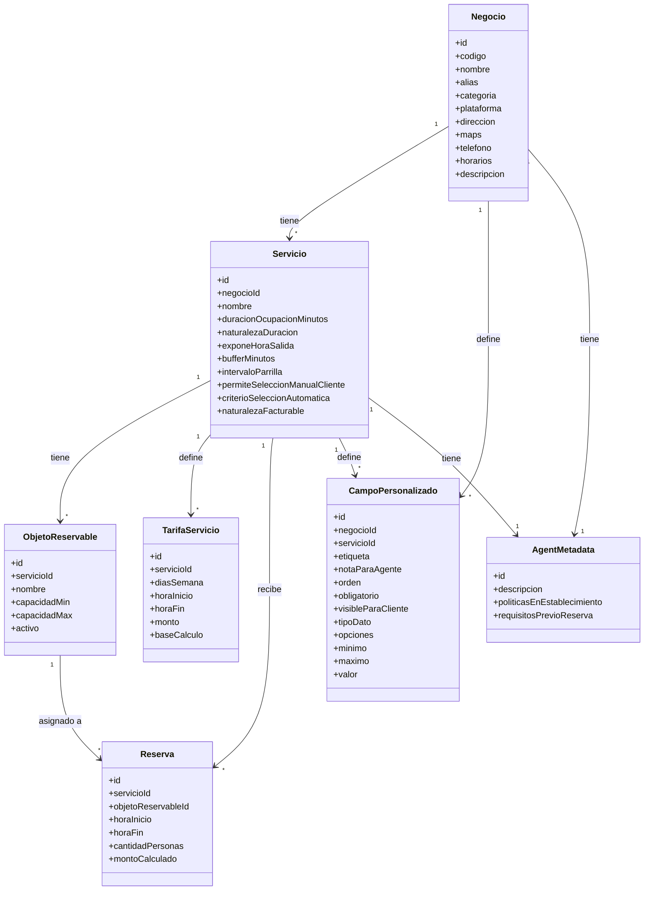

# Atlas B2B — Sistema de Reservas por Slots (Padel, Golf, Restaurantes)

**Estado:** nuevo alcance de producto. Reemplaza, para este conjunto de verticales, el modelo de scheduling dinámico (modo continuo) definido en la propuesta general de Atlas B2B, en favor de reservas sobre **slots de tiempo fijo** aplicados a **objetos reservables**.

---

## 1. Concepto central

Toda reserva ocupa un rango de tiempo `[horaInicio, horaInicio + duración]` sobre un **objeto reservable** — el descriptor físico de un cupo dentro de un slot (una mesa, una cancha, un tee). El mismo motor de cálculo (disponibilidad por solapamiento contra capacidad) sirve para los tres verticales; lo que cambia entre ellos es la configuración del servicio, no la lógica.

Diferencias clave entre los tres casos, resueltas como configuración y no como ramas de código distintas:

| | Padel | Golf | Restaurante |
|---|---|---|---|
| Naturaleza de la duración | Fija | Instantánea | Estimada |
| ¿Se muestra hora de salida al cliente? | Sí | No | No |
| Exclusividad del objeto | Total durante el rango | Casi nula (libera casi de inmediato) | Total durante el rango (aunque estimado) |
| Riesgo operativo | Bajo | Muy bajo | Overbooking si el turnover real no calza con la estimación (trade-off aceptado, no resuelto por el sistema) |

---

## 2. Entidades

### 2.1 Negocio

```
Negocio {
  id,
  codigo,                 // identificador interno corto
  nombre,
  alias: [ ... ],          // listado de variantes/combinaciones por las que el cliente podría referirse al negocio
  categoria,                // clasificación fina (plantilla de verificación/perfil, ver doc general de Atlas B2B)
  plataforma: Padel | Golf | Restaurante,  // vertical que determina la plantilla de configuración de reserva aplicada por defecto
  direccion,
  maps,                     // enlace/coordenadas de Google Maps
  telefono,
  horarios,                 // horario laboral general del negocio
  agentMetadataId            // referencia 1:1 a AgentMetadata (ver 2.7) — reemplaza el campo suelto de descripción
}
```

**Notas de diseño:**
- `alias` existe para que el agente reconozca al negocio aunque el cliente lo nombre distinto (apodos, variantes de escritura, nombres antiguos) — se usa en el matching conversacional, no es información que se le muestra al cliente.
- `plataforma` distingue el vertical (Padel/Golf/Restaurante) del que depende qué configuración por defecto aplica al crear un servicio (naturaleza de duración, exposición de hora de salida); `categoria` sigue siendo la clasificación más fina usada para plantillas de verificación/perfil ya definidas en el documento general de Atlas B2B.
- `maps` y `direccion` son datos independientes — `direccion` es el texto legible, `maps` es el enlace/coordenadas that el agente puede compartir directamente en conversación.

### 2.2 Servicio

```
Servicio {
  id,
  negocioId,
  nombre,

  // Comportamiento temporal
  duracionOcupacionMinutos,
  naturalezaDuracion: fija | estimada | instantanea,
  exponeHoraSalida: bool,
  bufferMinutos,
  intervaloParrilla,        // cada cuánto se ofrecen horas de inicio

  // Selección de objeto reservable
  permiteSeleccionManualCliente: bool,
  criterioSeleccionAutomatica: capacidadMaxMasCercana,  // siempre activo, incluso si hay selección manual (fallback / "any")

  // Facturación
  naturalezaFacturable: facturable | no_facturable,
  // si es no_facturable, no aplica TarifaServicio ni política de pago

  agentMetadataId            // referencia 1:1 a AgentMetadata (ver 2.7)
}
```

### 2.3 Objeto reservable

```
ObjetoReservable {
  id,
  servicioId,
  nombre,               // "Cancha A", "Mesa 5" — opcional si no tiene identidad visible al cliente (ej. Golf)
  capacidadMin,
  capacidadMax,
  activo: bool           // permite dar de baja (mantenimiento) sin borrar histórico
}
```

La cantidad de objetos disponibles de un servicio **es** el conteo de filas activas — no existe un campo de cantidad total separado.

**Regla de calificación:** un objeto califica para una reserva de `n` personas si `capacidadMin <= n <= capacidadMax`.

**Regla de selección automática:** entre los objetos que califican y están libres en el rango solicitado, se asigna el de `capacidadMax` más cercano a `n` (de arriba hacia abajo). Desempate: menor `id`/orden de creación. Este criterio es siempre el fallback, se use selección manual o no — un cliente que responde "cualquiera" cae en esta misma regla.

### 2.4 Tarifa de servicio

```
TarifaServicio {
  id,
  servicioId,
  diasSemana: [ ... ],
  horaInicio, horaFin,
  monto,
  baseCalculo: porReserva | porPersona
}
```

**Reglas decididas:**
- Solo aplica si el servicio es `facturable`.
- Las tarifas de un servicio deben **cubrir el horario laboral completo, sin huecos ni solapamientos** — se valida al guardar la configuración.
- El monto de una reserva se resuelve según la tarifa vigente en la **hora de inicio** de la reserva — nunca se prorratea entre dos ventanas de tarifa aunque la reserva termine dentro de otra ventana distinta.
- `baseCalculo: porPersona` multiplica el monto por `cantidadPersonas` de la reserva; es independiente del rango de capacidad del objeto asignado (una determina qué objeto se usa, la otra cuánto se cobra).

### 2.5 Reserva

```
Reserva {
  id,
  servicioId,
  objetoReservableId,     // asignado al momento de reservar (manual o automático)
  horaInicio,
  horaFin,                 // siempre calculada internamente, se muestre o no al cliente
  cantidadPersonas,
  montoCalculado            // resuelto contra TarifaServicio vigente en horaInicio, si aplica
}
```

### 2.6 Campo personalizado

```
CampoPersonalizado {
  id,
  negocioId,
  servicioId,               // null = aplica al negocio; con valor = aplica a ese servicio específico
  etiqueta,
  notaParaAgente,            // instrucción de cuándo/cómo debe usarlo el agente en conversación
  orden: int,                // secuencia de llenado (panel y flujo conversacional de creación)
  obligatorio: bool,         // bloquea publicación si falta
  visibleParaCliente: bool,  // false = uso interno del negocio, nunca se inyecta como contexto hacia el cliente

  tipoDato: texto_corto | texto_largo | numero | seleccion_unica | seleccion_multiple | si_no | fecha,
  opciones: [ ... ],          // solo si selección única/múltiple
  minimo, maximo,             // solo si numero

  valor
}
```

Reutiliza el mismo catálogo de tipos de dato que el sistema de formularios de cliente/servicio del documento general de Atlas B2B — validado al guardar contra `tipoDato` y sus restricciones. No tiene lógica condicional entre campos (los campos siempre aplican, no hay `aplicaSi`).

### 2.7 AgentMetadata

```
AgentMetadata {
  id,
  descripcion,                       // texto único — presentación narrativa
  politicasEnEstablecimiento: [ ... ],  // listado de textos, uno por política
  requisitosPrevioReserva: [ ... ]      // listado de textos, uno por requisito
}
```

Relación 1:1: tanto `Negocio` como `Servicio` tienen su propia referencia a un `AgentMetadata` (`agentMetadataId`) — no es una entidad compartida entre varios servicios o negocios, cada uno mantiene su propio contenido.

**Alcance de cada campo** (retomando la clasificación de la capa descriptiva del documento general de Atlas B2B):
- `descripcion`: presentación/venta — de qué se trata el negocio o el servicio. Un solo bloque de texto.
- `politicasEnEstablecimiento`: condicionan cómo se presta el servicio una vez reservado (cancelación, tardanza, qué traer) — un ítem de texto por política, no un bloque único, para que el agente pueda listarlas o citar una en particular.
- `requisitosPrevioReserva`: condiciones que determinan si el cliente puede reservar en absoluto (ej. mayoría de edad, dress code obligatorio) — el agente debería mencionarlas de forma proactiva durante la exploración/cotización, no solo al confirmar.

Todo el contenido de `AgentMetadata` pasa por el filtro de contenido definido en el documento general (lista negra sobre texto libre) y se inyecta como contexto conversacional del agente junto con el resto de la capa descriptiva (campos personalizados, FAQ si aplica).

---

## 3. Diagrama de clases



---

## 4. Cálculo de disponibilidad (unificado)

Para cualquier hora de inicio `T` de la parrilla (derivada de horario laboral + `intervaloParrilla`, no persistida como tabla):

1. Filtrar los `ObjetoReservable` activos del servicio cuyo `[capacidadMin, capacidadMax]` cubra la `cantidadPersonas` solicitada.
2. De esos, descartar los que ya tengan una reserva cuyo rango `[horaInicio, horaInicio+duración+buffer]` se solape con `[T, T+duración+buffer]`.
3. Si queda al menos uno, el slot tiene cupo — el conteo de sobrevivientes es cuántos objetos quedan libres.
4. Asignación: si `permiteSeleccionManualCliente` y el cliente especifica objeto, se usa ese (si califica y está libre); en cualquier otro caso, se aplica el criterio de selección automática (2.3).

La respuesta hacia el cliente varía solo en presentación (`exponeHoraSalida` decide si se comunica el rango completo o solo la hora de inicio) — el cálculo interno es idéntico para los tres verticales.

---

## 5. Aplicación a los tres verticales

**Golf:** `naturalezaDuracion: instantanea`, `exponeHoraSalida: false`. Objetos reservables sin nombre relevante para el cliente, `capacidad` normalmente fija por grupo. Caso más simple de los tres — casi sin solapamiento real entre slots.

**Padel:** `naturalezaDuracion: fija`, `exponeHoraSalida: true`. Cada cancha es un objeto reservable con nombre propio y exclusividad total durante el rango — el cliente ve el rango completo porque la cancha le pertenece hasta la hora de salida.

**Restaurante:** `naturalezaDuracion: estimada`, `exponeHoraSalida: false`, `naturalezaFacturable: no_facturable` (se reserva la mesa, no se paga el servicio en sí). Cada mesa es un objeto reservable con `capacidadMin/Max` variable (2/4/6), y la asignación automática favorece la mesa más ajustada al tamaño del grupo. El sistema calcula solapamiento contra una duración estimada, no garantizada — riesgo de overbooking real si el turnover no calza, aceptado como trade-off consciente (igual que en sistemas de referencia del mercado como OpenTable), no resuelto por el sistema en el MVP.

---

## 6. Decisiones registradas (resumen)

- Un único motor de solapamiento-por-capacidad sirve para los tres verticales; la diferencia vive en configuración del servicio, no en lógica distinta.
- La capacidad de un objeto reservable es un rango (`min`/`max`), no un valor único.
- El criterio de selección automática (capacidad máxima más cercana a la cantidad de personas) siempre está activo, sea o no el negocio permite selección manual — es el fallback universal, incluido el caso "cualquiera".
- Las tarifas por horario deben cubrir el horario laboral completo sin huecos ni solapamientos (validado al guardar).
- El monto de una reserva se resuelve por la hora de inicio, nunca por prorrateo entre ventanas de tarifa.
- Un servicio puede ser `no_facturable` (ej. restaurantes) — en ese caso no aplica tarifa ni política de pago.
- Los campos personalizados (negocio o servicio) son tipados y validados igual que los formularios de cliente/servicio del documento general, siempre aplican (sin condición de contexto), y separan uso interno (`visibleParaCliente: false`) de contenido cara al cliente.
- Se introdujo `AgentMetadata` como entidad propia (relación 1:1 con Negocio y con Servicio) para agrupar Descripción (texto único), Políticas en el establecimiento (listado de textos) y Requisitos previos de reserva (listado de textos), reemplazando el campo suelto de descripción que tenía Negocio.
