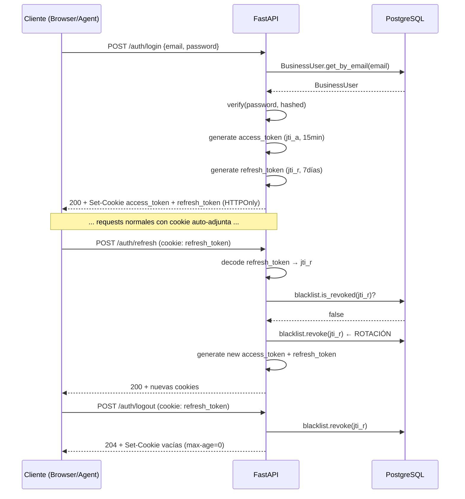

# Atlas B2B — Plan: Sistema de Autenticación (JWT + HTTPOnly Cookies)

## Contexto y Decisiones de Diseño

### Por qué HTTPOnly cookies en lugar de `Authorization: Bearer`
- El access token **no es accesible desde JavaScript** en ningún momento, eliminando el riesgo de exfiltración por XSS.
- El browser adjunta la cookie automáticamente en cada request al mismo dominio/subdominio.
- El tradeoff es que la API del agente de IA (que consume la Business API directamente desde un servidor) deberá manejar cookies explícitamente — esto es trivial con `httpx` o `requests`.

### Esquema: Access + Refresh Tokens

```
┌──────────────────────────────────────────────────────────────────────┐
│                        POST /auth/login                               │
│  {email, password} → valida credenciales → emite dos cookies:        │
│    access_token  (short-lived: 15min) — HTTPOnly, Secure, SameSite  │
│    refresh_token (long-lived: 7 días) — HTTPOnly, Secure, SameSite  │
└──────────────────────────────────────────────────────────────────────┘

┌──────────────────────────────────────────────────────────────────────┐
│                        POST /auth/refresh                             │
│  Lee cookie refresh_token → valida → rota (invalida el anterior)     │
│  → emite nuevas cookies access_token + refresh_token                 │
└──────────────────────────────────────────────────────────────────────┘

┌──────────────────────────────────────────────────────────────────────┐
│                        POST /auth/logout                              │
│  Lee cookie refresh_token → añade a blacklist → borra ambas cookies  │
└──────────────────────────────────────────────────────────────────────┘
```

### Email global único

El ORM actual tiene `UniqueConstraint("business_id", "email")` — es decir, el email solo es único **dentro de un negocio**. Necesitamos cambiar esto a un índice único **global** sobre solo `email`. Esto requiere:
1. Cambiar el constraint en el modelo ORM.
2. Cambiar el método del repositorio `get_by_email(email, business_id)` → `get_by_email(email)`.
3. Generar una migración Alembic.

### Rotación de Refresh Tokens y Revocación

Usaremos una tabla `refresh_token_blacklist` en PostgreSQL para registrar los tokens revocados (por `logout` o por rotación). El token lleva un `jti` (JWT ID) único — es lo que se revoca, no el token entero.

> [!NOTE]
> Alternativa más ligera sería Redis para la blacklist, pero dado que ya tenemos PostgreSQL y el volumen de logout no es masivo, usaremos una tabla simple con cleanup periódico.

---

## Cambios Necesarios

---

### Base de Datos y ORM

#### [MODIFY] [business_user_model.py](file:///c:/Users/pluto/source/repos/ENSO/atlas_b2b/atlas_b2b_backend/src/Infrastructure/Persistence/Models/business_user_model.py)

Cambiar el constraint:
```python
# ANTES
sa.UniqueConstraint("business_id", "email", name="uq_business_user_email"),

# DESPUÉS — email único globalmente
sa.UniqueConstraint("email", name="uq_business_user_email_global"),
```

#### [NEW] Modelo ORM `refresh_token_blacklist_model.py`

Nueva tabla para revocación:

```python
class RefreshTokenBlacklistModel(Base):
    __tablename__ = "refresh_token_blacklist"

    jti: Mapped[str] = mapped_column(sa.String(64), primary_key=True)
    expires_at: Mapped[datetime] = mapped_column(sa.TIMESTAMP(timezone=True), nullable=False)
    revoked_at: Mapped[datetime] = mapped_column(sa.TIMESTAMP(timezone=True), nullable=False)
```

> [!NOTE]
> Solo guardamos el `jti` y la fecha de expiración. Un job de limpieza puede borrar filas donde `expires_at < NOW()` para mantener la tabla pequeña.

#### [NEW] Script SQL Alembic / migración

```sql
-- 1. Eliminar constraint viejo
ALTER TABLE business_user DROP CONSTRAINT uq_business_user_email;

-- 2. Crear constraint global
ALTER TABLE business_user ADD CONSTRAINT uq_business_user_email_global 
    UNIQUE (email);

-- 3. Nueva tabla
CREATE TABLE refresh_token_blacklist (
    jti         VARCHAR(64) PRIMARY KEY,
    expires_at  TIMESTAMPTZ NOT NULL,
    revoked_at  TIMESTAMPTZ NOT NULL DEFAULT NOW()
);
CREATE INDEX ix_refresh_token_blacklist_expires ON refresh_token_blacklist(expires_at);
```

---

### Domain Layer

#### [MODIFY] [i_business_user_repository.py](file:///c:/Users/pluto/source/repos/ENSO/atlas_b2b/atlas_b2b_backend/src/Domain/Ports/Repositories/i_business_user_repository.py)

Cambiar firma del método de búsqueda por email:
```python
# ANTES
async def get_by_email(self, email: str, business_id: UUID) -> BusinessUser | None:

# DESPUÉS — búsqueda global
async def get_by_email(self, email: str) -> BusinessUser | None:
```

#### [NEW] Puerto `i_token_blacklist_repository.py`

```python
class ITokenBlacklistRepository(ABC):
    @abstractmethod
    async def is_revoked(self, jti: str) -> bool: ...

    @abstractmethod
    async def revoke(self, jti: str, expires_at: datetime) -> None: ...
```

---

### Application Layer

#### [NEW] `src/Application/UseCases/Auth/`

```
Auth/
├── login.py              ← LoginUseCase
├── refresh_token.py      ← RefreshTokenUseCase
└── logout.py             ← LogoutUseCase
```

**`LoginUseCase`**:
```python
@dataclass
class LoginCommand:
    email: str
    password: str

class LoginUseCase:
    # 1. get_by_email(email) — búsqueda global, sin business_id
    # 2. Verificar is_active
    # 3. hashing_service.verify(password, user.hashed_password)
    # 4. Generar access_token (15 min, payload: sub, business_id, roles, jti)
    # 5. Generar refresh_token (7 días, payload: sub, jti_refresh)
    # 6. Retornar ambos tokens + UserContext básico para la respuesta
```

**`RefreshTokenUseCase`**:
```python
class RefreshTokenUseCase:
    # 1. Decodificar refresh_token → obtener sub y jti_refresh
    # 2. Verificar que jti_refresh NO esté en blacklist
    # 3. Obtener user por ID para refrescar roles actuales
    # 4. Revocar el jti_refresh anterior (rotación)
    # 5. Generar nuevos access_token + refresh_token
```

**`LogoutUseCase`**:
```python
class LogoutUseCase:
    # 1. Decodificar refresh_token → obtener jti_refresh
    # 2. Revocar jti_refresh en blacklist
    # → La cookie se borra en el router (set-cookie vacío con max-age=0)
```

---

### Infrastructure Layer

#### [MODIFY] [business_user_repository.py](file:///c:/Users/pluto/source/repos/ENSO/atlas_b2b/atlas_b2b_backend/src/Infrastructure/Persistence/Repositories/business_user_repository.py)

Actualizar `get_by_email` para buscar globalmente:
```python
async def get_by_email(self, email: str) -> BusinessUser | None:
    stmt = select(BusinessUserModel).where(
        BusinessUserModel.email == email
    )
    ...
```

#### [NEW] `token_blacklist_repository.py`

Implementación concreta de `ITokenBlacklistRepository` usando PostgreSQL.

---

### Presentation Layer

#### [MODIFY] [auth.py (Dependencies)](file:///c:/Users/pluto/source/repos/ENSO/atlas_b2b/atlas_b2b_backend/src/Presentation/Dependencies/auth.py)

Reemplazar `OAuth2PasswordBearer` por lectura de cookie HTTPOnly:

```python
async def get_current_user(
    request: Request,
    settings: Settings = Depends(get_settings),
    blacklist_repo: ITokenBlacklistRepository = Depends(get_blacklist_repo),
) -> UserContext:
    token = request.cookies.get("access_token")
    if not token:
        raise HTTPException(status_code=401, detail="No autenticado.")
    
    try:
        payload = jwt.decode(token, settings.SECRET_KEY, algorithms=[settings.ALGORITHM])
        jti = payload.get("jti")
        
        # Verificar que el access token no esté revocado
        # (Opcional: en muchas arquitecturas solo se revoca el refresh)
        
        return UserContext(
            user_id=UUID(payload["sub"]),
            business_id=UUID(payload["business_id"]),
            roles=payload.get("roles", []),
        )
    except JWTError:
        raise HTTPException(status_code=401, detail="Token inválido o expirado.")
```

#### [NEW] `src/Presentation/Routers/business/auth_router.py`

```python
router = APIRouter(prefix="/auth", tags=["Auth"])

# Helper interno
def _set_auth_cookies(response: Response, access_token: str, refresh_token: str):
    response.set_cookie(
        key="access_token",
        value=access_token,
        httponly=True,
        secure=True,          # Solo HTTPS. En dev: False si no tienes SSL local.
        samesite="lax",       # Protección CSRF. "strict" si no hay cross-site.
        max_age=15 * 60,      # 15 minutos
        path="/",
    )
    response.set_cookie(
        key="refresh_token",
        value=refresh_token,
        httponly=True,
        secure=True,
        samesite="lax",
        max_age=7 * 24 * 3600,  # 7 días
        path="/api/v1/business/auth/refresh",  # ← Solo se envía a este path
    )

@router.post("/login")
async def login(body: LoginRequest, response: Response, ...):
    result = await LoginUseCase(...).execute(LoginCommand(body.email, body.password))
    _set_auth_cookies(response, result.access_token, result.refresh_token)
    return {"user_id": result.user_id, "business_id": result.business_id, "roles": result.roles}

@router.post("/refresh")
async def refresh(request: Request, response: Response, ...):
    refresh_token = request.cookies.get("refresh_token")
    if not refresh_token:
        raise HTTPException(status_code=401)
    result = await RefreshTokenUseCase(...).execute(RefreshTokenCommand(refresh_token))
    _set_auth_cookies(response, result.access_token, result.refresh_token)
    return {"ok": True}

@router.post("/logout", status_code=204)
async def logout(request: Request, response: Response, ...):
    refresh_token = request.cookies.get("refresh_token")
    if refresh_token:
        await LogoutUseCase(...).execute(LogoutCommand(refresh_token))
    response.delete_cookie("access_token")
    response.delete_cookie("refresh_token", path="/api/v1/business/auth/refresh")
    return None
```

#### [MODIFY] [Settings](file:///c:/Users/pluto/source/repos/ENSO/atlas_b2b/atlas_b2b_backend/src/Settings/settings.py)

Agregar configuración de tokens:
```python
ACCESS_TOKEN_EXPIRE_MINUTES: int = 15
REFRESH_TOKEN_EXPIRE_DAYS: int = 7
COOKIE_SECURE: bool = True          # False en dev local sin HTTPS
COOKIE_SAMESITE: str = "lax"
```

#### [MODIFY] [.env](file:///c:/Users/pluto/source/repos/ENSO/atlas_b2b/atlas_b2b_backend/src/.env)

Agregar variables:
```env
ACCESS_TOKEN_EXPIRE_MINUTES=15
REFRESH_TOKEN_EXPIRE_DAYS=7
COOKIE_SECURE=False   # True en producción
COOKIE_SAMESITE=lax
```

---

## Flujo Completo



---

## Open Questions

> [!IMPORTANT]
> **`samesite` y entorno del agente de IA**
> El agente de IA (que consumirá la Business API desde un servidor) no corre en un browser, así que las restricciones `samesite` no aplican directamente. Sin embargo, si el agente hace requests desde un dominio distinto al API, `samesite=strict` causaría que las cookies no se adjunten. **¿Confirmas que `samesite=lax` es adecuado para tu setup?**

> [!NOTE]
> **`COOKIE_SECURE=False` en desarrollo**
> En desarrollo local sin HTTPS, `secure=True` impide que la cookie se envíe. Planificamos agregar `COOKIE_SECURE` a Settings para poder desactivarlo en dev. ¿Tu entorno de desarrollo usa HTTPS local (ej. con `mkcert`)?

> [!NOTE]
> **Cleanup de blacklist**
> Las filas expiradas en `refresh_token_blacklist` se pueden limpiar con un job de `pg_cron` o un endpoint interno. ¿Quieres que lo incluyamos en el plan o lo dejamos para una fase posterior?
